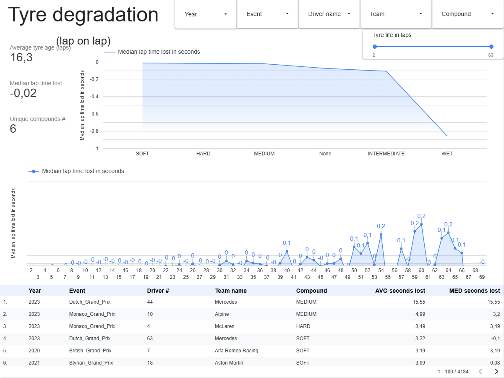
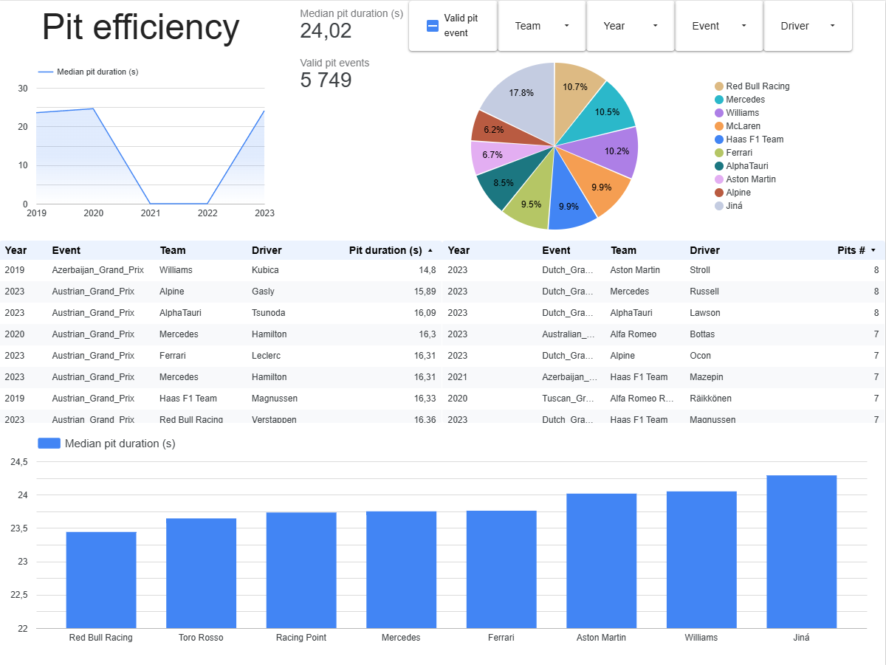
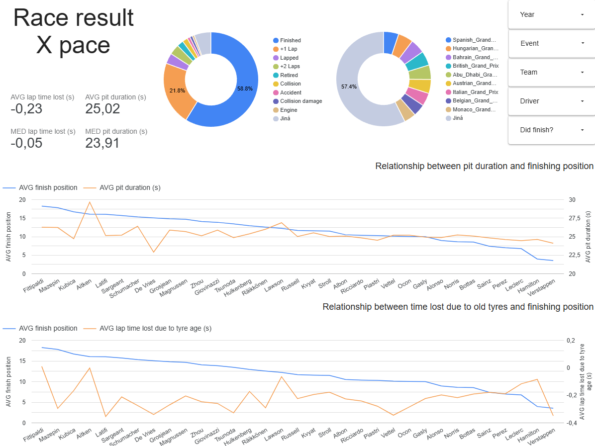

# F1 Analytics: Data-Engineering-Zoomcamp-26-final-project

## Brief description/problem statement

Goal: process and analyse F1 data, especially tyre and pit stop information in relation to race results
FastF1 is used as datasource due to its pre-processing and availability.
3 questions are to be answered:

    1) How drivers slow down due to tire age (incl. distinction by compound)?
    2) Which teams and drivers spend most time in pit?
    3) How are these information related to race results?

Dashboard link: https://lookerstudio.google.com/reporting/95c7a1f8-8a68-4a7e-8425-57ae1774b60a

## Notes/limitations

- FastF1 can be unstable due to upstream APIs
- ```results.Time``` is winner time/gap to winner
- pit stop efficiency is heuristics from lap-level data (excl. red flag laps and such)
- ```track_status``` is simplified for analytics, with a focus on clean laps (```is_only_clear_track```) for tyre degradation analysis

## Possible improvements / future work

- replace the inline ingestion Python script in Kestra with a repository-cloned script approach, similar to the dbt flow
- add richer race dimension metadata such as circuit, country, and event date
- improve pit stop modeling using more explicit event-level or telemetry/race-control sources
- extend data quality testing in dbt beyond key and relationship checks
- add a more polished dashboard layer and richer visual explanations

## Architecture

Raw data are stored in GCS as parquet files with hive-style partitions and then merged into native BigQuery tables before dbt transformations
- flow:
```
FastF1 API 
    --> Kestra ingest (Docker, Python) 
        --> GCS parquets w/ hive-style partitions 
            --> BQ external tables 
                --> BQ raw tables 
                    --> dbt models (staging, intermediate, mart, reporting) 
                        --> Looker
```

### Tech stack

- Kestra
- FastF1
- GCS/BQ
- dbt Core
- Terraform
- Docker Compose
- uv

### Data model

- raw
    1) laps_raw
    2) results_raw
- staging
    1) stg_laps
    2) stg_results
- intermediate
    1) int_track_status
- marts
    1) dim_season_drivers_teams     (driver x season x team grain)
    2) fct_laps                     (lap grain)
    3) fct_results                  (results grain)
- reporting
    1) rpt_pit_efficiency           (lap/pit x driver grain)
    2) rpt_tyre_degradation         (lap x driver grain)
    3) rpt_race_result_vs_pace      (results grain)

## Reproducibility

### Prerequisites

1) GCP account (enabled billing, service account for GCS and BQ admin; use ```gcloud resource-manager org-policies disable-enforce iam.disableServiceAccountKeyCreation --project=PROJECT_NAME``` in console if needed)
2) google cloud SDK
3) terraform
4) docker
5) uv

### How to reproduce

1) Dependencies
```bash
uv sync
```

2) Create GCP project with service account and export json with credentials

- for smooth reproduction use ```service_account.json``` name in the ```root``` repo

3) Terraform
- choose project, bucket, dataset, location, service account via ```variables.tf```
- run resources creation
```bash
terraform plan      # see what will be created
terraform apply     # actually create resources
```
- after running ```apply``` check/align values in ```main_company.team_gcp_kv_v2.yml``` (see below)

```bash
terraform destroy   # clear your GCP after all desired checks (e.g. to avoid extra billing later!)
```

4) Environment variable for GCP credentials
- create file ```.env_encoded``` in ```root``` repo
- contents have to be:
```
SECRET_GCP_SERVICE_ACCOUNT=GCP_SERVICE_ACCOUNT_JSON_ENCODED_IN_BASE64_UTF-8-CRLF
```
- replace ```GCP_SERVICE_ACCOUNT_JSON_ENCODED_IN_BASE64_UTF-8-CRLF``` with contents of ```service_account.json``` file encoded in base64, using UTF-8 encoding and CRLF newline separator (e.g. base64encode.org/)

5) Kestra/GCP connection
- open ```main_company.team_gcp_kv_v2.yml``` in ```flows``` directory
- update the values to match your created GCP resources (also used e.g. in ```variables.tf```)
- this flow will run in the master flow so it does not require its own run

6) Docker compose
- run:
```bash
docker-compose up -d
```

7) Kestra
- visit ```localhost:8080/``` to access Kestra UI
- use credentials from ```docker-compose.yaml```
```yml
username: "admin@kestra.io"
password: Admin1234
```
- find flow ```gcp_f1_master``` and run it
- dbt subflow clones the project from the public GitHub repository to run the models
- if running from a fork or modified copy, update the repository URL in ```main_company.team_gcp_f1_dbt_build.yml```

*) Optional: dbt profiles for local development
- ```profiles.yml``` is optional because Kestra dbt execution does not use it, this ```only``` for local development
- if you want to try dbt models locally (no via Kestra runner), you will need your own local ```profiles.yml``` file in the ```root``` repo
- see ```profiles.yml.example``` as reference and use the same values used for terraform or kestra kv setup
- run to check connections etc.
```bash
uv run dbt debug --project-dir f1_analytics_dbt --profiles-dir .
```
- run for build from local CLI
```bash
uv run dbt build --project-dir f1_analytics_dbt --profiles-dir .
```

## Dashboard sheets/question answered

### Tyre degradation



### Pit efficiency



### Race recult X pace

